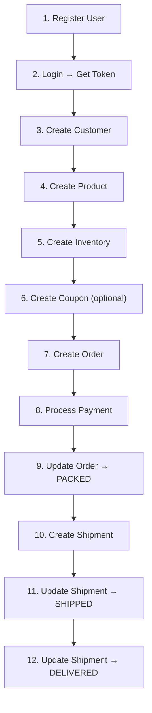
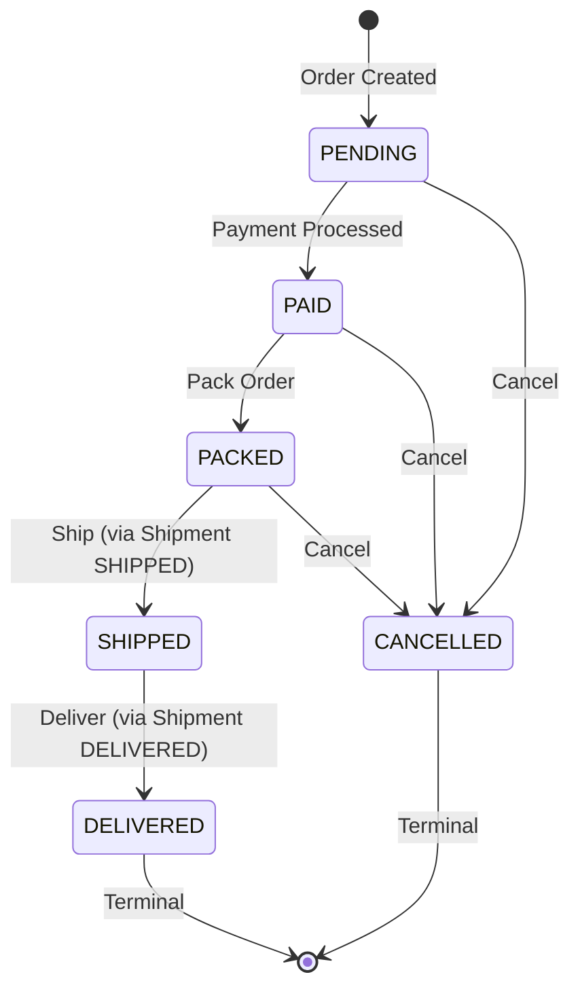
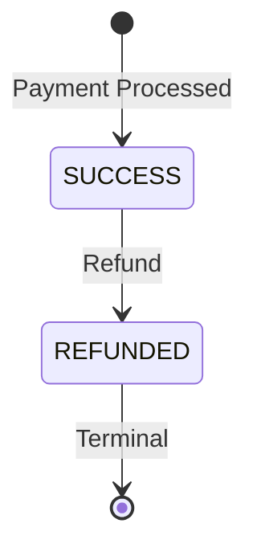
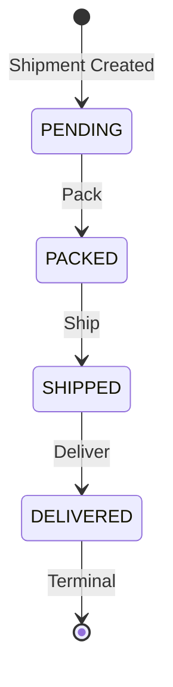
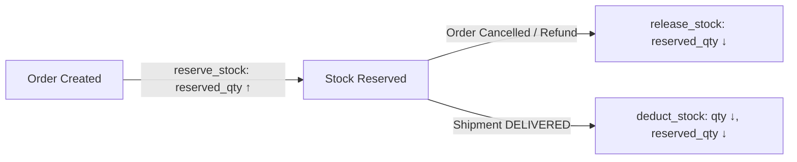
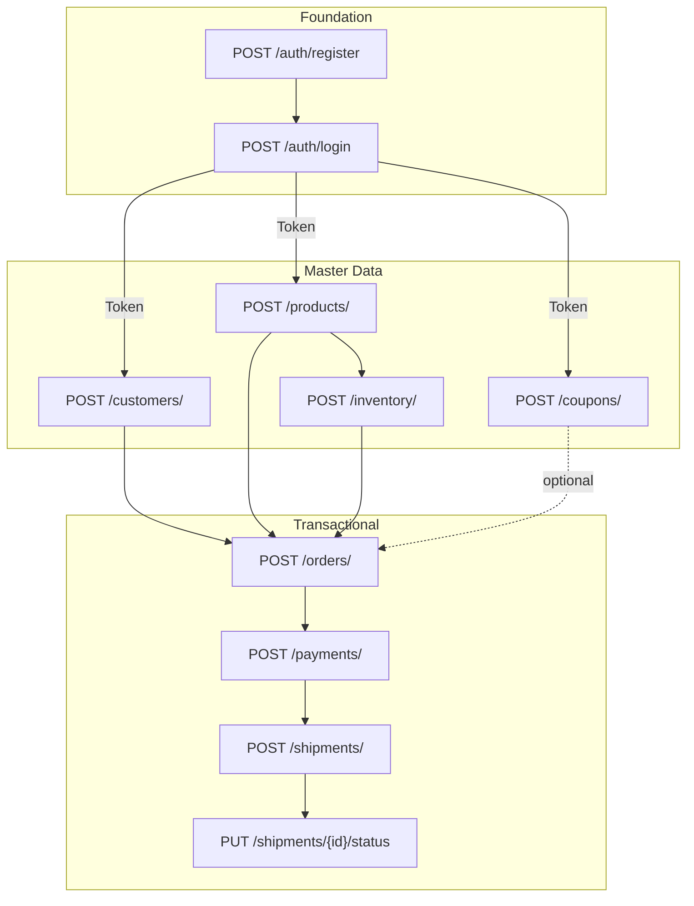
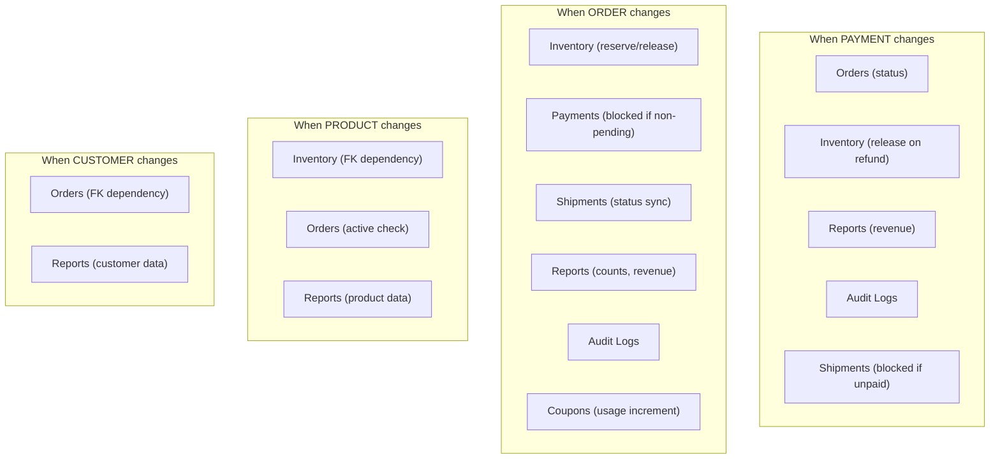

# QA_SYSTEM_CONTEXT — Order Management System

> **Document Purpose**: Machine-readable knowledge base for autonomous QA agents.
> **Source of Truth**: Application source code at commit time.
> **Last Generated**: 2026-06-29
> **Target Consumer**: LLM-based autonomous testing platform.

---

## 1. System Overview

### 1.1 Purpose
Production-grade Order Management System (OMS) backend for e-commerce order lifecycle management. Handles customer registration, product catalog, inventory across warehouses, order placement with GST tax calculation, coupon-based discounts, payment processing, shipment tracking, and audit logging.

### 1.2 Domain
Indian e-commerce B2C order fulfillment. Currency: INR (₹). Tax: GST (Goods and Services Tax) at variable rates per product category (5%, 12%, 18%, 28%).

### 1.3 Architecture

```
Layer           │ Technology          │ Responsibility
────────────────┼─────────────────────┼──────────────────────────────
API Router      │ FastAPI (0.115.12)  │ HTTP endpoints, auth deps
Service Layer   │ Plain Python        │ Business logic, orchestration
Repository      │ SQLAlchemy 2.x ORM  │ Data access, queries
Database        │ SQLite (oms.db)     │ Persistence
Auth            │ PyJWT + bcrypt      │ JWT tokens, password hashing
Validation      │ Pydantic v2         │ Request/response schemas
```

### 1.4 Technologies
- **Runtime**: Python 3.13
- **Framework**: FastAPI 0.115.12
- **ORM**: SQLAlchemy 2.0.41 (synchronous mode)
- **Database**: SQLite with WAL journal mode, foreign keys enabled
- **Auth**: PyJWT 2.10.1 (HS256), bcrypt 4.3.0
- **Validation**: Pydantic 2.11.4 with email validator
- **Logging**: Loguru 0.7.3 (structured JSON or human-readable)
- **Migrations**: Alembic 1.15.2
- **Server**: Uvicorn 0.34.2

### 1.5 Deployment
- **Default host**: `0.0.0.0`
- **Default port**: `8000`
- **Base URL**: `http://localhost:8000`
- **API prefix**: `/api/v1`
- **Database file**: `./oms.db` (SQLite)
- **Auto-create tables**: On startup via `Base.metadata.create_all()`

### 1.6 Documentation Endpoints
| Endpoint | Description |
|----------|-------------|
| `GET /docs` | Swagger UI (interactive) |
| `GET /redoc` | ReDoc (read-only) |
| `GET /openapi.json` | OpenAPI 3.x specification |
| `GET /health` | Health check: `{"status": "healthy", "version": "1.0.0"}` |

### 1.7 Authentication Mechanism
- **Type**: OAuth2 Bearer Token (JWT)
- **Token URL**: `/api/v1/auth/login` (form-encoded: `username` + `password`)
- **Access token expiry**: 30 minutes (configurable)
- **Refresh token expiry**: 7 days (configurable)
- **Algorithm**: HS256
- **Header format**: `Authorization: Bearer <token>`

### 1.8 Configuration (Environment Variables)
| Variable | Default | Description |
|----------|---------|-------------|
| `APP_ENV` | `development` | Environment name |
| `APP_HOST` | `0.0.0.0` | Bind host |
| `APP_PORT` | `8000` | Bind port |
| `APP_DEBUG` | `True` | Debug mode |
| `APP_TITLE` | `Order Management System` | App title |
| `APP_VERSION` | `1.0.0` | Semantic version |
| `DATABASE_URL` | `sqlite:///./oms.db` | SQLAlchemy database URL |
| `JWT_SECRET_KEY` | `change-this-to-a-secure-random-string-in-production` | HMAC signing key |
| `JWT_ALGORITHM` | `HS256` | JWT algorithm |
| `JWT_ACCESS_TOKEN_EXPIRE_MINUTES` | `30` | Access token TTL |
| `JWT_REFRESH_TOKEN_EXPIRE_DAYS` | `7` | Refresh token TTL |
| `LOG_LEVEL` | `INFO` | Logging level |
| `LOG_FORMAT` | `json` | `json` or `human` |
| `ENABLE_NEGATIVE_INVENTORY` | `False` | Bug flag: allow negative stock |
| `ENABLE_DUPLICATE_PAYMENT` | `False` | Bug flag: skip duplicate txn check |
| `ENABLE_WRONG_GST` | `False` | Bug flag: inflate GST by +5% |
| `ENABLE_SKIP_AUDIT_LOG` | `False` | Bug flag: suppress audit logs |
| `ENABLE_SHIPMENT_WITHOUT_PAYMENT` | `False` | Bug flag: skip payment check for shipment |

---

## 2. Business Domains

### 2.1 Authentication
**Responsibilities**: User registration, login, JWT token issuance/refresh, user profile retrieval.

**Entities**: `User` (table: `users`)

**APIs**:
| Method | Path | Auth | Roles | Description |
|--------|------|------|-------|-------------|
| POST | `/api/v1/auth/register` | No | Public | Register new user |
| POST | `/api/v1/auth/login` | No | Public | Login, returns token pair |
| POST | `/api/v1/auth/refresh` | No | Public | Refresh token rotation |
| GET | `/api/v1/auth/me` | Yes | Any | Current user profile |

**Dependencies**: None (foundational module).

**Validations**:
- Username: 3-50 chars, alphanumeric + underscores only, unique
- Email: Valid format (EmailStr), unique
- Password: 8-128 chars
- Role: defaults to `USER` enum value

**Failure Conditions**:
- `409 CONFLICT`: Duplicate username or email
- `401 AUTHENTICATION_ERROR`: Invalid credentials, expired token, deactivated account
- `422 VALIDATION_ERROR`: Invalid field format

### 2.2 Customers
**Responsibilities**: Customer CRUD, uniqueness enforcement on email/phone, deletion guard for active orders.

**Entities**: `Customer` (table: `customers`)

**APIs**:
| Method | Path | Auth | Roles | Description |
|--------|------|------|-------|-------------|
| POST | `/api/v1/customers/` | Yes | ADMIN, MANAGER | Create customer |
| GET | `/api/v1/customers/` | Yes | Any | List (paginated) |
| GET | `/api/v1/customers/{id}` | Yes | Any | Get by ID |
| PUT | `/api/v1/customers/{id}` | Yes | ADMIN, MANAGER | Update customer |
| DELETE | `/api/v1/customers/{id}` | Yes | ADMIN | Delete customer |

**Dependencies**: Orders (deletion guard checks active orders).

**Validations**:
- Name: 1-100 chars, required
- Email: valid EmailStr, unique across customers
- Phone: 1-20 chars, only digits/+/-/spaces/parens after stripping, unique
- Address: optional, max 500 chars
- Loyalty points: integer >= 0, default 0

**Failure Conditions**:
- `409 CONFLICT`: Duplicate email or phone
- `404 NOT_FOUND`: Customer ID not found
- `422 BUSINESS_VALIDATION_ERROR`: Cannot delete customer with active (non-terminal) orders

### 2.3 Products
**Responsibilities**: Product catalog CRUD, SKU uniqueness, soft-delete (marks as inactive).

**Entities**: `Product` (table: `products`)

**APIs**:
| Method | Path | Auth | Roles | Description |
|--------|------|------|-------|-------------|
| POST | `/api/v1/products/` | Yes | ADMIN, MANAGER | Create product |
| GET | `/api/v1/products/` | Yes | Any | List (paginated, optional `active_only` filter) |
| GET | `/api/v1/products/{id}` | Yes | Any | Get by ID |
| PUT | `/api/v1/products/{id}` | Yes | ADMIN, MANAGER | Update product |
| DELETE | `/api/v1/products/{id}` | Yes | ADMIN | Soft-delete (set active=False) |

**Dependencies**: Inventory, OrderItems (products referenced by both).

**Validations**:
- SKU: 1-50 chars, auto-uppercased, unique
- Name: 1-200 chars
- Description: optional, max 1000 chars
- Price: Decimal > 0, max 10 digits, 2 decimal places
- GST percentage: Decimal >= 0, max 5 digits, 2 decimal places
- Active: boolean, default True
- SKU is NOT updatable via PUT

**Failure Conditions**:
- `409 CONFLICT`: Duplicate SKU
- `422 BUSINESS_VALIDATION_ERROR`: Price <= 0
- `404 NOT_FOUND`: Product ID not found

### 2.4 Inventory
**Responsibilities**: Track stock quantities per product per warehouse, stock reservation/release/deduction.

**Entities**: `Inventory` (table: `inventory`)

**APIs**:
| Method | Path | Auth | Roles | Description |
|--------|------|------|-------|-------------|
| POST | `/api/v1/inventory/` | Yes | ADMIN, MANAGER | Create inventory record |
| GET | `/api/v1/inventory/` | Yes | Any | List (paginated, filter by product_id/warehouse) |
| GET | `/api/v1/inventory/{id}` | Yes | Any | Get by ID |
| PUT | `/api/v1/inventory/{id}` | Yes | ADMIN, MANAGER | Update quantity/reserved |

**No DELETE endpoint exists for inventory.**

**Dependencies**: Products (foreign key), Orders (reservation/deduction triggered by order lifecycle).

**Validations**:
- Product ID: must reference existing product, > 0
- Warehouse: 1-100 chars, required
- Quantity: integer >= 0
- Reserved quantity: integer >= 0
- Unique constraint on (product_id, warehouse) combination

**Failure Conditions**:
- `404 NOT_FOUND`: Product not found, inventory record not found
- `409 CONFLICT`: Duplicate product+warehouse pair
- `409 INSUFFICIENT_STOCK`: Not enough available stock for reservation

### 2.5 Orders
**Responsibilities**: Order creation with multi-item support, GST calculation, coupon application, stock reservation, status lifecycle management, cancellation with stock release.

**Entities**: `Order` (table: `orders`), `OrderItem` (table: `order_items`)

**APIs**:
| Method | Path | Auth | Roles | Description |
|--------|------|------|-------|-------------|
| POST | `/api/v1/orders/` | Yes | Any | Create order |
| GET | `/api/v1/orders/` | Yes | Any | List (paginated, filter by status/customer_id) |
| GET | `/api/v1/orders/{id}` | Yes | Any | Get with items |
| PUT | `/api/v1/orders/{id}/status` | Yes | ADMIN, MANAGER | Update status |
| DELETE | `/api/v1/orders/{id}` | Yes | ADMIN | Cancel order |

**Dependencies**: Customers (FK), Products (FK, active check), Inventory (reservation), Coupons (discount), Payments (lifecycle), Shipments (lifecycle).

**Validations**:
- Customer ID: must exist, > 0
- Items: at least 1 item required, no duplicate product_ids in same order
- Per item: product_id > 0, quantity >= 1
- Coupon code: optional, max 50 chars
- All products must be active
- Sufficient inventory must be available

**Failure Conditions**:
- `404 ENTITY_NOT_FOUND`: Customer or product not found
- `422 INVALID_ORDER`: Product is inactive
- `409 INSUFFICIENT_STOCK`: Not enough stock
- `422 INVALID_COUPON`: Invalid/expired/used/min-not-met coupon
- `409 INVALID_STATE_TRANSITION`: Illegal status change

### 2.6 Payments
**Responsibilities**: Payment processing, amount validation against order total, duplicate transaction detection, refund processing with stock release.

**Entities**: `Payment` (table: `payments`)

**APIs**:
| Method | Path | Auth | Roles | Description |
|--------|------|------|-------|-------------|
| POST | `/api/v1/payments/` | Yes | Any | Process payment |
| GET | `/api/v1/payments/{id}` | Yes | Any | Get by ID |
| GET | `/api/v1/payments/order/{order_id}` | Yes | Any | Get by order |
| POST | `/api/v1/payments/{id}/refund` | Yes | ADMIN, MANAGER | Refund payment |

**Dependencies**: Orders (FK, status update), Inventory (stock release on refund).

**Validations**:
- Order ID: must exist, order must be in PENDING status
- Method: valid PaymentMethod enum
- Transaction reference: 1-255 chars, unique
- Amount: must exactly match order.total (Decimal > 0)
- No existing SUCCESS payment for the order

**Failure Conditions**:
- `404 ENTITY_NOT_FOUND`: Order or payment not found
- `409 INVALID_STATE_TRANSITION`: Order not in PENDING status
- `409 CONFLICT`: Already has successful payment, duplicate transaction reference
- `402 PAYMENT_ERROR`: Amount does not match order total

### 2.7 Shipments
**Responsibilities**: Shipment creation for packed orders, status tracking, delivery confirmation with stock deduction.

**Entities**: `Shipment` (table: `shipments`)

**APIs**:
| Method | Path | Auth | Roles | Description |
|--------|------|------|-------|-------------|
| POST | `/api/v1/shipments/` | Yes | ADMIN, MANAGER | Create shipment |
| GET | `/api/v1/shipments/{id}` | Yes | Any | Get by ID |
| GET | `/api/v1/shipments/order/{order_id}` | Yes | Any | Get by order |
| PUT | `/api/v1/shipments/{id}/status` | Yes | ADMIN, MANAGER | Update status |

**Dependencies**: Orders (FK, status sync), Payments (order must be paid), Inventory (stock deduction on delivery).

**Validations**:
- Order ID: must exist, order must be in PAID or PACKED status
- Tracking number: 1-100 chars, unique
- Carrier: 1-100 chars
- No existing shipment for the order (one-to-one)

**Failure Conditions**:
- `404 ENTITY_NOT_FOUND`: Order or shipment not found
- `422 BUSINESS_VALIDATION_ERROR`: Order not in PAID/PACKED status
- `409 CONFLICT`: Shipment already exists for order, duplicate tracking number
- `409 INVALID_STATE_TRANSITION`: Illegal shipment status change

### 2.8 Coupons
**Responsibilities**: Coupon CRUD, discount calculation (percentage or flat), validation (active, not expired, min order, usage limits).

**Entities**: `Coupon` (table: `coupons`)

**APIs** (uses `code` as path parameter, not numeric ID):
| Method | Path | Auth | Roles | Description |
|--------|------|------|-------|-------------|
| POST | `/api/v1/coupons/` | Yes | ADMIN | Create coupon |
| GET | `/api/v1/coupons/` | Yes | Any | List (paginated) |
| GET | `/api/v1/coupons/{code}` | Yes | Any | Get by code |
| PUT | `/api/v1/coupons/{code}` | Yes | ADMIN | Update coupon |
| DELETE | `/api/v1/coupons/{code}` | Yes | ADMIN | Deactivate coupon (soft) |

**Dependencies**: Orders (coupon application during order creation).

**Validations**:
- Code: 1-50 chars, unique
- Discount type: `percentage` or `flat` enum
- Discount value: Decimal > 0
- Percentage discount capped at 100% (model_validator on create, NOT on update — potential gap)
- Minimum order: Decimal >= 0
- Expiry: required datetime
- Single-use flag: boolean
- Active flag: boolean

**Failure Conditions**:
- `409 CONFLICT`: Duplicate coupon code
- `404 ENTITY_NOT_FOUND`: Coupon code not found

### 2.9 Reports
**Responsibilities**: Aggregate analytics — sales revenue, order statistics, inventory health, customer spending.

**APIs**:
| Method | Path | Auth | Roles | Description |
|--------|------|------|-------|-------------|
| GET | `/api/v1/reports/sales` | Yes | ADMIN, MANAGER | Revenue, avg order value, top products |
| GET | `/api/v1/reports/orders` | Yes | ADMIN, MANAGER | Order counts by status, recent orders |
| GET | `/api/v1/reports/inventory` | Yes | ADMIN, MANAGER | Low stock, out-of-stock, warehouse summary |
| GET | `/api/v1/reports/customers` | Yes | ADMIN, MANAGER | Top spenders, recent customers |

**Revenue statuses**: Only PAID, PACKED, SHIPPED, DELIVERED orders count toward revenue (excludes PENDING and CANCELLED).

### 2.10 Audit Logs
**Responsibilities**: Immutable event trail for all mutations across the system.

**Entities**: `AuditLog` (table: `audit_logs`)

**APIs**:
| Method | Path | Auth | Roles | Description |
|--------|------|------|-------|-------------|
| GET | `/api/v1/audit-logs/` | Yes | ADMIN | Query logs (paginated, filterable) |

**Read-only**: No create/update/delete API endpoints. Logs are created internally by services.

**Filter behavior** (priority-based, NOT AND-combined):
1. If `performed_by` is set → filters by performer only (ignores entity/action)
2. Elif `action` is set AND `entity` is None → filters by action only
3. Elif `entity` is set → filters by entity (and optionally entity_id)
4. Else → returns all

---

## 3. Business Rules

### 3.1 Authentication Rules
| ID | Rule | Source |
|----|------|--------|
| AUTH-01 | Username must be unique (case-sensitive) | `AuthService.register` |
| AUTH-02 | Email must be unique (case-sensitive) | `AuthService.register` |
| AUTH-03 | Password minimum length is 8 characters | `UserCreate` schema |
| AUTH-04 | Username allows only letters, digits, and underscores | `UserCreate.username_alphanumeric` validator |
| AUTH-05 | Default role for new users is USER | `UserCreate.role` default |
| AUTH-06 | Deactivated users cannot login | `AuthService.login` checks `is_active` |
| AUTH-07 | Deactivated users cannot access protected endpoints | `get_current_active_user` dependency |
| AUTH-08 | Refresh tokens cannot be used as access tokens | `get_current_user` checks `type == "access"` |
| AUTH-09 | Access tokens cannot be used as refresh tokens | `AuthService.refresh_token` checks `type == "refresh"` |
| AUTH-10 | Token refresh issues entirely new token pair (sliding window) | `AuthService.refresh_token` |

### 3.2 Customer Rules
| ID | Rule | Source |
|----|------|--------|
| CUST-01 | Customer email must be unique | `CustomerService.create` |
| CUST-02 | Customer phone must be unique | `CustomerService.create` |
| CUST-03 | Cannot delete customer with active (non-terminal) orders | `CustomerService.delete` |
| CUST-04 | Terminal order statuses are DELIVERED and CANCELLED | `OrderStatus.is_terminal` |
| CUST-05 | Email/phone uniqueness checked on update (excluding self) | `CustomerService.update` |

### 3.3 Product Rules
| ID | Rule | Source |
|----|------|--------|
| PROD-01 | SKU must be unique (case-insensitive due to auto-uppercase) | `ProductService.create` |
| PROD-02 | Price must be strictly greater than zero | `ProductService.create` |
| PROD-03 | SKU is auto-uppercased on creation | `ProductCreate.sku_uppercase` validator |
| PROD-04 | SKU is NOT updatable after creation | `ProductUpdate` schema excludes SKU |
| PROD-05 | DELETE performs soft-delete (sets active=False) | `ProductService.delete` |
| PROD-06 | Inactive products cannot be included in new orders | `OrderService.create_order` |

### 3.4 Inventory Rules
| ID | Rule | Source |
|----|------|--------|
| INV-01 | Product+warehouse combination must be unique | `UniqueConstraint("product_id", "warehouse")` |
| INV-02 | Referenced product must exist | `InventoryService.create` |
| INV-03 | Quantity and reserved_quantity must be >= 0 | Schema validation |
| INV-04 | Stock reservation selects first warehouse with sufficient available stock | `InventoryService.reserve_stock` |
| INV-05 | Available stock = quantity - reserved_quantity | `InventoryService.reserve_stock` |
| INV-06 | Stock release decrements reserved_quantity across warehouses | `InventoryService.release_stock` |
| INV-07 | Stock deduction decrements both quantity AND reserved_quantity | `InventoryService.deduct_stock` |
| INV-08 | No inventory DELETE endpoint exists | Route definition |

### 3.5 Order Rules
| ID | Rule | Source |
|----|------|--------|
| ORD-01 | Orders must have at least 1 line item | `OrderCreate.items` min_length=1 |
| ORD-02 | Duplicate product IDs not allowed in same order | `OrderCreate.validate_unique_products` model_validator |
| ORD-03 | All products in order must be active | `OrderService.create_order` |
| ORD-04 | All products in order must exist | `OrderService.create_order` |
| ORD-05 | Customer must exist | `OrderService.create_order` |
| ORD-06 | Stock is reserved immediately on order creation | `InventoryService.reserve_stock` |
| ORD-07 | If order creation fails after stock reservation, stock is released (rollback) | `OrderService.create_order` exception handler |
| ORD-08 | Order total = subtotal + tax - discount | `OrderService.create_order` |
| ORD-09 | Tax is calculated per-item using product's GST percentage | `OrderService.create_order` |
| ORD-10 | Cancellation releases reserved stock for all items | `OrderService.update_status` |
| ORD-11 | Only valid state transitions are allowed | `OrderStatus.can_transition_to()` |
| ORD-12 | Terminal orders (DELIVERED, CANCELLED) cannot transition further | `OrderStatus.is_terminal` |
| ORD-13 | New orders start in PENDING status | `Order.status` default |
| ORD-14 | Discount cannot exceed subtotal (capped) | `CouponService.validate_and_apply` |

### 3.6 Payment Rules
| ID | Rule | Source |
|----|------|--------|
| PAY-01 | Payment can only be made for PENDING orders | `PaymentService.process_payment` |
| PAY-02 | Payment amount must exactly match order total | `PaymentService.process_payment` |
| PAY-03 | Transaction reference must be unique | `PaymentService.process_payment` |
| PAY-04 | No duplicate successful payment for same order | `PaymentService.process_payment` |
| PAY-05 | Successful payment automatically transitions order to PAID | `PaymentService.process_payment` |
| PAY-06 | Payments are created directly as SUCCESS (no intermediate PENDING) | `PaymentService.process_payment` |
| PAY-07 | Only SUCCESS payments can be refunded | `PaymentService.refund` |
| PAY-08 | Refund sets payment status to REFUNDED | `PaymentService.refund` |
| PAY-09 | Refund sets order status to CANCELLED (BYPASSES state machine) | `PaymentService.refund` |
| PAY-10 | Refund releases all reserved stock | `PaymentService.refund` |
| PAY-11 | One-to-one: order_id is unique in payments table | `Payment.order_id` unique=True |

### 3.7 Shipment Rules
| ID | Rule | Source |
|----|------|--------|
| SHIP-01 | Shipment can only be created for PAID or PACKED orders | `ShipmentService.create_shipment` |
| SHIP-02 | Only one shipment per order (one-to-one) | `ShipmentService.create_shipment` / unique FK |
| SHIP-03 | Tracking number must be unique | `ShipmentService.create_shipment` |
| SHIP-04 | Shipment created with PENDING status | `ShipmentService.create_shipment` |
| SHIP-05 | SHIPPED status sets shipped_at timestamp and order → SHIPPED | `ShipmentService.update_status` |
| SHIP-06 | DELIVERED status sets delivered_at timestamp and order → DELIVERED | `ShipmentService.update_status` |
| SHIP-07 | DELIVERED status triggers stock deduction (reserved → actual decrease) | `ShipmentService.update_status` |

### 3.8 Coupon Rules
| ID | Rule | Source |
|----|------|--------|
| CPN-01 | Coupon code must be unique | `CouponService.create` |
| CPN-02 | Coupon must be active to apply | `CouponService.validate_and_apply` |
| CPN-03 | Expired coupon cannot be applied (expiry <= now is expired) | `CouponService.validate_and_apply` |
| CPN-04 | Single-use coupon cannot be reused after used=True | `CouponService.validate_and_apply` |
| CPN-05 | Order subtotal must meet minimum_order requirement | `CouponService.validate_and_apply` |
| CPN-06 | Percentage discount: subtotal × (value / 100) | `CouponService.validate_and_apply` |
| CPN-07 | Flat discount: fixed amount | `CouponService.validate_and_apply` |
| CPN-08 | Discount is capped at subtotal (cannot produce negative total before tax) | `CouponService.validate_and_apply` |
| CPN-09 | Percentage discount value capped at 100 on CREATE only (not UPDATE) | `CouponCreate.validate_percentage_cap` |
| CPN-10 | DELETE endpoint deactivates coupon (sets active=False), does not hard-delete | `CouponService.deactivate` |
| CPN-11 | Single-use coupon marked as used=True after order creation | `OrderService.create_order` |

### 3.9 Audit Rules
| ID | Rule | Source |
|----|------|--------|
| AUD-01 | All entity mutations must create audit log entries | All service layers |
| AUD-02 | Audit logs are immutable (no update/delete API) | Route definition |
| AUD-03 | Only ADMIN can query audit logs | `RoleChecker([ADMIN])` |
| AUD-04 | Audit log filters use priority-based selection, not AND combination | `AuditService.get_logs` |

### 3.10 Report Rules
| ID | Rule | Source |
|----|------|--------|
| RPT-01 | Revenue includes only PAID, PACKED, SHIPPED, DELIVERED orders | `ReportService._REVENUE_STATUSES` |
| RPT-02 | PENDING and CANCELLED orders are excluded from revenue | `ReportService._REVENUE_STATUSES` |
| RPT-03 | Average order value = total_revenue / total_orders (0 if no orders) | `ReportService.sales_report` |
| RPT-04 | Top products: top 10 by total quantity sold | `ReportService.sales_report` |
| RPT-05 | Low stock threshold default: quantity < 10 | `ReportService.inventory_report` |

---

## 4. Entity Relationships

### 4.1 ER Diagram

```mermaid
erDiagram
    User {
        int id PK
        string username UK
        string email UK
        string hashed_password
        enum role
        bool is_active
        datetime created_at
        datetime updated_at
    }

    Customer {
        int id PK
        string name
        string email UK
        string phone UK
        string address
        int loyalty_points
        datetime created_at
        datetime updated_at
    }

    Product {
        int id PK
        string sku UK
        string name
        string description
        decimal price
        decimal gst_percentage
        bool active
        datetime created_at
        datetime updated_at
    }

    Inventory {
        int id PK
        int product_id FK
        string warehouse
        int quantity
        int reserved_quantity
        datetime updated_at
    }

    Order {
        int id PK
        int customer_id FK
        enum status
        decimal subtotal
        decimal tax
        decimal discount
        decimal total
        string coupon_code
        datetime created_at
        datetime updated_at
    }

    OrderItem {
        int id PK
        int order_id FK
        int product_id FK
        int quantity
        decimal unit_price
        decimal total_price
    }

    Payment {
        int id PK
        int order_id FK_UK
        enum status
        enum method
        string transaction_reference UK
        decimal amount
        datetime created_at
    }

    Shipment {
        int id PK
        int order_id FK_UK
        string tracking_number UK
        string carrier
        enum status
        datetime shipped_at
        datetime delivered_at
        datetime created_at
        datetime updated_at
    }

    Coupon {
        int id PK
        string code UK
        enum discount_type
        decimal discount_value
        decimal minimum_order
        datetime expiry
        bool active
        bool single_use
        bool used
        datetime created_at
    }

    AuditLog {
        int id PK
        string entity
        string entity_id
        enum action
        text old_value
        text new_value
        string performed_by
        datetime timestamp
    }

    Customer ||--o{ Order : "has"
    Order ||--|{ OrderItem : "contains"
    Product ||--o{ OrderItem : "referenced_in"
    Product ||--o{ Inventory : "stocked_in"
    Order ||--o| Payment : "has"
    Order ||--o| Shipment : "has"
```

### 4.2 Relationship Details

| Parent | Child | Cardinality | FK Column | On Delete | Back Populates |
|--------|-------|-------------|-----------|-----------|----------------|
| Customer | Order | 1:N | `orders.customer_id` | No cascade | `customer ↔ orders` |
| Order | OrderItem | 1:N | `order_items.order_id` | CASCADE | `order ↔ items` |
| Product | OrderItem | 1:N | `order_items.product_id` | No cascade | `product ↔ order_items` |
| Product | Inventory | 1:N | `inventory.product_id` | No cascade | `product ↔ inventory_items` |
| Order | Payment | 1:0..1 | `payments.order_id` (UNIQUE) | No cascade | `order ↔ payment` |
| Order | Shipment | 1:0..1 | `shipments.order_id` (UNIQUE) | No cascade | `order ↔ shipment` |

### 4.3 Standalone Entities (No FK)
- **User**: No FK relationships to any other entity
- **Coupon**: No FK. Linked to Order only via `Order.coupon_code` string field
- **AuditLog**: No FK. Uses string `entity` and `entity_id` for polymorphic reference

### 4.4 All Lazy Loading
Every relationship uses `lazy="selectin"` (batch subquery loading).

### 4.5 Cascade
Only `Order.items` has `cascade="all, delete-orphan"`. All other relationships use SQLAlchemy defaults.

---

## 5. Workflow Definitions

### 5.1 End-to-End Order Fulfillment



**Step 7 — Create Order (Orchestrator):**
1. Validate customer exists
2. Validate all products exist and are active
3. Reserve stock for each item (rollback on failure)
4. Calculate subtotal (sum of unit_price × quantity)
5. Calculate GST per item (item_total × gst_percentage / 100)
6. If coupon: validate and calculate discount
7. Calculate total = subtotal + tax - discount
8. Persist Order + OrderItems
9. Mark single-use coupon as used
10. Create audit log

**Preconditions**: Customer, products, and inventory must exist. Products must be active. Sufficient stock.

**Rollback**: If any step after stock reservation fails, all reserved stock is released.

**Database Impact**: Creates 1 Order row, N OrderItem rows, updates N Inventory rows (reserved_quantity), optionally updates 1 Coupon row (used=True), creates 1+ AuditLog rows.

### 5.2 Payment Processing

**Preconditions**: Order exists in PENDING status, no existing SUCCESS payment.

**Steps**:
1. Validate order exists and is PENDING
2. Verify no existing SUCCESS payment for order
3. Verify amount matches order.total exactly
4. Verify transaction_reference uniqueness
5. Create Payment with status=SUCCESS
6. Update order status to PAID
7. Create audit log

**Database Impact**: Creates 1 Payment row, updates 1 Order row (status), creates 1 AuditLog row.

**Failure Scenarios**:
- Amount mismatch → 402 PaymentError
- Order not PENDING → 409 InvalidStateTransition
- Duplicate txn reference → 409 Conflict

### 5.3 Refund Processing

**Preconditions**: Payment exists with SUCCESS status.

**Steps**:
1. Validate payment is SUCCESS
2. Set payment status to REFUNDED
3. Set order status to CANCELLED (bypasses state machine!)
4. Release stock for all order items
5. Create audit log

**CRITICAL**: Refund bypasses order state machine validation. A SHIPPED order can be cancelled via refund even though SHIPPED→CANCELLED is NOT in the allowed transitions. This is a design decision QA should verify.

**Database Impact**: Updates 1 Payment row, 1 Order row, N Inventory rows (reserved_quantity), creates 1 AuditLog row.

### 5.4 Shipment Lifecycle

**Preconditions**: Order is PAID or PACKED, no existing shipment.

**Steps**:
1. Create shipment (status=PENDING)
2. Update shipment → PACKED (no side effects)
3. Update shipment → SHIPPED (sets shipped_at, order → SHIPPED)
4. Update shipment → DELIVERED (sets delivered_at, order → DELIVERED, deducts stock)

**Database Impact on DELIVERED**: Updates 1 Shipment row, 1 Order row, N Inventory rows (both quantity and reserved_quantity decrease).

### 5.5 Order Cancellation

**Preconditions**: Order is NOT in terminal state (not DELIVERED, not CANCELLED).

**Steps**:
1. Validate order exists and is non-terminal
2. Validate CURRENT_STATUS → CANCELLED is allowed transition
3. Set order status to CANCELLED
4. Release reserved stock for all items
5. Create audit log

**Allowed cancel transitions**: PENDING→CANCELLED, PAID→CANCELLED, PACKED→CANCELLED. NOT: SHIPPED→CANCELLED (except via refund bypass).

---

## 6. State Machines

### 6.1 Order Status



**Transition Matrix:**
| From \ To | PENDING | PAID | PACKED | SHIPPED | DELIVERED | CANCELLED |
|-----------|---------|------|--------|---------|-----------|-----------|
| PENDING | - | ✅ | ❌ | ❌ | ❌ | ✅ |
| PAID | ❌ | - | ✅ | ❌ | ❌ | ✅ |
| PACKED | ❌ | ❌ | - | ✅ | ❌ | ✅ |
| SHIPPED | ❌ | ❌ | ❌ | - | ✅ | ❌* |
| DELIVERED | ❌ | ❌ | ❌ | ❌ | - | ❌ |
| CANCELLED | ❌ | ❌ | ❌ | ❌ | ❌ | - |

*SHIPPED→CANCELLED is NOT allowed via normal status update, but IS achieved via refund (bypasses state machine).

### 6.2 Payment Status



Note: Payments are created directly as SUCCESS. There is no PENDING→SUCCESS transition in the application flow (PaymentStatus.PENDING exists in enum but is never used in service code).

### 6.3 Shipment Status



**Transition Matrix:**
| From \ To | PENDING | PACKED | SHIPPED | DELIVERED |
|-----------|---------|--------|---------|-----------|
| PENDING | - | ✅ | ❌ | ❌ |
| PACKED | ❌ | - | ✅ | ❌ |
| SHIPPED | ❌ | ❌ | - | ✅ |
| DELIVERED | ❌ | ❌ | ❌ | - |

### 6.4 Stock Lifecycle Through Order



---

## 7. API Dependency Graph



### Dependency Table
| API | Hard Dependencies | Soft Dependencies |
|-----|-------------------|-------------------|
| Create Order | Customer exists, Products exist + active, Inventory available | Coupon valid |
| Process Payment | Order exists in PENDING status | - |
| Create Shipment | Order exists in PAID or PACKED status | - |
| Shipment → SHIPPED | Shipment exists in PACKED status | - |
| Shipment → DELIVERED | Shipment exists in SHIPPED status | Inventory for deduction |
| Refund Payment | Payment exists with SUCCESS status | - |
| Delete Customer | Customer has no active orders | - |
| Create Inventory | Product exists | - |

---

## 8. Validation Rules

### 8.1 Field-Level Validation

| Entity | Field | Type | Required | Min | Max | Pattern/Format | Default |
|--------|-------|------|----------|-----|-----|----------------|---------|
| User | username | string | Yes | 3 | 50 | `[a-zA-Z0-9_]+` | - |
| User | email | EmailStr | Yes | - | - | RFC 5322 | - |
| User | password | string | Yes | 8 | 128 | - | - |
| User | role | UserRole | No | - | - | admin/manager/user | user |
| Customer | name | string | Yes | 1 | 100 | - | - |
| Customer | email | EmailStr | Yes | - | - | RFC 5322, unique | - |
| Customer | phone | string | Yes | 1 | 20 | digits, +, -, spaces, parens | - |
| Customer | address | string | No | - | 500 | - | None |
| Customer | loyalty_points | int | No | 0 | - | - | 0 |
| Product | sku | string | Yes | 1 | 50 | Auto-uppercased, unique | - |
| Product | name | string | Yes | 1 | 200 | - | - |
| Product | description | string | No | - | 1000 | - | None |
| Product | price | Decimal | Yes | >0 | 10 digits | 2 decimal places | - |
| Product | gst_percentage | Decimal | Yes | >=0 | 5 digits | 2 decimal places | - |
| Inventory | product_id | int | Yes | >0 | - | FK exists | - |
| Inventory | warehouse | string | Yes | 1 | 100 | - | - |
| Inventory | quantity | int | Yes | >=0 | - | - | - |
| Inventory | reserved_quantity | int | No | >=0 | - | - | 0 |
| Order | customer_id | int | Yes | >0 | - | FK exists | - |
| Order | items | list | Yes | 1 item | - | No duplicate product_ids | - |
| OrderItem | product_id | int | Yes | >0 | - | FK exists, active | - |
| OrderItem | quantity | int | Yes | >=1 | - | - | - |
| Order | coupon_code | string | No | - | 50 | Valid active coupon | None |
| Payment | order_id | int | Yes | >0 | - | FK exists, PENDING | - |
| Payment | method | PaymentMethod | Yes | - | - | 6 enum values | - |
| Payment | transaction_reference | string | Yes | 1 | 255 | Unique | - |
| Payment | amount | Decimal | Yes | >0 | 12 digits | Must match order.total | - |
| Shipment | order_id | int | Yes | >0 | - | FK exists, PAID/PACKED | - |
| Shipment | tracking_number | string | Yes | 1 | 100 | Unique | - |
| Shipment | carrier | string | Yes | 1 | 100 | - | - |
| Coupon | code | string | Yes | 1 | 50 | Unique | - |
| Coupon | discount_type | DiscountType | Yes | - | - | percentage/flat | - |
| Coupon | discount_value | Decimal | Yes | >0 | 10 digits | <=100 if percentage (create only) | - |
| Coupon | minimum_order | Decimal | No | >=0 | - | - | 0.00 |
| Coupon | expiry | datetime | Yes | - | - | - | - |

### 8.2 Cross-Field Validations
| Schema | Validation | Error |
|--------|-----------|-------|
| `OrderCreate` | No duplicate `product_id` values in `items` list | `ValueError` |
| `CouponCreate` | If `discount_type == PERCENTAGE`, then `discount_value <= 100` | `ValueError` |
| `PaymentCreate` | `amount` must equal `order.total` | `PaymentError` |

### 8.3 Cross-Entity Validations
| Check | Entities | Service |
|-------|----------|---------|
| Customer email unique across all customers | Customer | CustomerService |
| Customer phone unique across all customers | Customer | CustomerService |
| Product SKU unique across all products | Product | ProductService |
| Product+Warehouse unique in inventory | Inventory | InventoryService |
| Transaction reference unique across payments | Payment | PaymentService |
| Tracking number unique across shipments | Shipment | ShipmentService |
| Coupon code unique across coupons | Coupon | CouponService |
| Username unique across users | User | AuthService |
| User email unique across users | User | AuthService |

### 8.4 Authorization Validation
| Operation | ADMIN | MANAGER | USER |
|-----------|-------|---------|------|
| Create customer/product/inventory | ✅ | ✅ | ❌ |
| Update customer/product/inventory | ✅ | ✅ | ❌ |
| Delete customer/product | ✅ | ❌ | ❌ |
| Create/update order | ✅ | ✅ | ✅ |
| Update order status | ✅ | ✅ | ❌ |
| Cancel order (DELETE) | ✅ | ❌ | ❌ |
| Process payment | ✅ | ✅ | ✅ |
| Refund payment | ✅ | ✅ | ❌ |
| Create/update shipment | ✅ | ✅ | ❌ |
| CRUD coupons | ✅ | ❌ | ❌ |
| View reports | ✅ | ✅ | ❌ |
| View audit logs | ✅ | ❌ | ❌ |

---

## 9. Database Expectations

### 9.1 Create Order
| Table | Operation | Expected |
|-------|-----------|----------|
| `orders` | INSERT | 1 row: customer_id, status=PENDING, calculated subtotal/tax/discount/total |
| `order_items` | INSERT | N rows (one per item): order_id, product_id, quantity, unit_price, total_price |
| `inventory` | UPDATE | N rows: reserved_quantity += item.quantity |
| `coupons` | UPDATE | 0-1 rows: used=True (if single_use) |
| `audit_logs` | INSERT | 1+ rows: CREATED + COUPON_APPLIED + STOCK_RESERVED |

**Invariants**:
- `order.subtotal == SUM(order_items.total_price)`
- `order_item.total_price == order_item.unit_price × order_item.quantity`
- `order_item.unit_price == product.price` (at time of order)
- `order.tax == SUM(item.total_price × product.gst_percentage / 100)` for each item
- `order.total == order.subtotal + order.tax - order.discount`

### 9.2 Process Payment
| Table | Operation | Expected |
|-------|-----------|----------|
| `payments` | INSERT | 1 row: order_id, status=SUCCESS, method, txn_ref, amount=order.total |
| `orders` | UPDATE | 1 row: status → PAID |
| `audit_logs` | INSERT | 1 row: PAYMENT_PROCESSED |

**Invariant**: `payment.amount == order.total`

### 9.3 Create Shipment
| Table | Operation | Expected |
|-------|-----------|----------|
| `shipments` | INSERT | 1 row: order_id, tracking_number, carrier, status=PENDING |
| `audit_logs` | INSERT | 1 row: CREATED |

### 9.4 Shipment → DELIVERED
| Table | Operation | Expected |
|-------|-----------|----------|
| `shipments` | UPDATE | 1 row: status=DELIVERED, delivered_at=now |
| `orders` | UPDATE | 1 row: status=DELIVERED |
| `inventory` | UPDATE | N rows: quantity -= X, reserved_quantity -= X |
| `audit_logs` | INSERT | 1 row: STATUS_CHANGED |

### 9.5 Cancel Order
| Table | Operation | Expected |
|-------|-----------|----------|
| `orders` | UPDATE | 1 row: status=CANCELLED |
| `inventory` | UPDATE | N rows: reserved_quantity -= item.quantity |
| `audit_logs` | INSERT | 1 row: STATUS_CHANGED |

### 9.6 Refund Payment
| Table | Operation | Expected |
|-------|-----------|----------|
| `payments` | UPDATE | 1 row: status=REFUNDED |
| `orders` | UPDATE | 1 row: status=CANCELLED |
| `inventory` | UPDATE | N rows: reserved_quantity -= item.quantity |
| `audit_logs` | INSERT | 1 row: PAYMENT_REFUNDED |

### 9.7 Transaction Boundaries
- Services call `db.flush()` but NOT `db.commit()`
- `get_db()` dependency commits on success, rolls back on exception
- All operations within a single request share one transaction

---

## 10. Security Expectations

### 10.1 Authentication
- Passwords hashed with bcrypt (12 rounds, per-hash salt)
- JWT tokens signed with HS256 using configurable secret key
- Default secret is insecure (`change-this-to-a-secure-random-string-in-production`)
- Access tokens expire in 30 minutes
- Refresh tokens expire in 7 days
- Token type claim differentiates access vs refresh

### 10.2 Authorization (RBAC)
Three roles in hierarchy: ADMIN > MANAGER > USER
- ADMIN: Full access to all operations
- MANAGER: CRUD business entities + reports, no user management, no audit logs, no coupon management
- USER: Read access + create orders + process payments

### 10.3 Expected Security Failures
| Scenario | Expected | HTTP Code |
|----------|----------|-----------|
| No Authorization header | 401 | `Not authenticated` |
| Malformed token | 401 | `Invalid token` |
| Expired access token | 401 | `Token has expired` |
| Refresh token used as access | 401 | `Invalid token type` |
| USER role creating customer | 403 | `Authorization error` |
| Deactivated user | 401 | `User account is deactivated` |
| Wrong password | 401 | `Invalid username or password` |
| Nonexistent username | 401 | `Invalid username or password` |

### 10.4 Potential Attack Vectors for QA Testing
1. **Token replay**: Use expired tokens
2. **Token type confusion**: Use refresh token as access token
3. **Role escalation**: USER trying admin-only operations
4. **JWT secret brute-force**: Not testable via API
5. **SQL injection via query params**: page, page_size, entity filters
6. **Path traversal via path params**: customer_id, order_id
7. **Mass assignment**: Send extra fields in JSON body
8. **Horizontal privilege escalation**: Any user can view any order/customer (no ownership check exists)
9. **Rate limiting**: None implemented (DoS vector)
10. **CORS**: Not configured (no CORSMiddleware)

### 10.5 Security Assumptions
- No per-user data isolation (any authenticated user can read all orders/customers)
- No API rate limiting
- No request size limits beyond framework defaults
- No CORS configuration
- No HTTPS enforcement
- No password complexity rules beyond minimum length (8)
- No account lockout after failed attempts

---

## 11. Error Handling

### 11.1 Error Response Format
All error responses follow this structure:
```json
{
  "error": {
    "code": "MACHINE_READABLE_CODE",
    "message": "Human-readable description",
    "details": {"key": "value"}
  }
}
```

### 11.2 Exception → HTTP Status Mapping
| Exception Class | Code | HTTP Status |
|----------------|------|-------------|
| `EntityNotFoundError` | `ENTITY_NOT_FOUND` | 404 |
| `AuthenticationError` | `AUTHENTICATION_ERROR` | 401 |
| `AuthorizationError` | `AUTHORIZATION_ERROR` | 403 |
| `PaymentError` | `PAYMENT_ERROR` | 402 |
| `ConflictError` | `CONFLICT` | 409 |
| `InvalidStateTransitionError` | `INVALID_STATE_TRANSITION` | 409 |
| `InsufficientStockError` | `INSUFFICIENT_STOCK` | 409 |
| `BusinessValidationError` | `BUSINESS_VALIDATION_ERROR` | 422 |
| `InvalidCouponError` | `INVALID_COUPON` | 422 |
| `InvalidOrderError` | `INVALID_ORDER` | 422 |
| `RequestValidationError` | `VALIDATION_ERROR` | 422 |
| Unhandled `Exception` | `INTERNAL_SERVER_ERROR` | 500 |

### 11.3 Validation Error Format
```json
{
  "error": {
    "code": "VALIDATION_ERROR",
    "message": "Request validation failed",
    "details": {
      "errors": [
        {"field": "body → password", "message": "String should have at least 8 characters", "type": "string_too_short"}
      ]
    }
  }
}
```
Field paths use ` → ` separator for nested fields.

### 11.4 Expected Error Scenarios per Module

**Authentication**:
- 401: invalid credentials, expired token, token type mismatch, deactivated user
- 409: duplicate username, duplicate email
- 422: invalid email format, short password, non-alphanumeric username

**Customers**:
- 401/403: unauthorized access
- 404: customer not found
- 409: duplicate email, duplicate phone
- 422: business validation (active orders prevent delete)

**Orders**:
- 404: customer/product not found
- 409: insufficient stock, invalid state transition
- 422: inactive product, invalid coupon, duplicate product_ids, empty items

**Payments**:
- 402: amount mismatch
- 404: order/payment not found
- 409: order not pending, duplicate txn reference, already paid, cannot refund non-success

---

## 12. Bug Injection Framework

### 12.1 Architecture
Bugs are controlled via environment variables (Settings class). The `BugRegistry` singleton reads `get_settings()` (cached via `@lru_cache`) to check `enable_{bug_name}` flags. No runtime API to toggle bugs — requires app restart.

### 12.2 Bug Catalog

#### BUG: `WRONG_GST`
- **Flag**: `ENABLE_WRONG_GST=True`
- **Location**: `app/bugs/injectors.py::calculate_gst()` → `app/services/order.py`
- **Normal behavior**: GST = `subtotal × (gst_percentage / 100)`
- **Bug behavior**: GST = `subtotal × ((gst_percentage + 5) / 100)` — inflates GST by 5 percentage points
- **Detection strategy**:
  1. Create order with known products/quantities
  2. Calculate expected tax: `SUM(item_total × product.gst_percentage / 100)`
  3. Compare with `order.tax` from API response
  4. If `order.tax > expected_tax`, bug is active
- **Assertions**: `order.tax == expected_tax` (exact Decimal match)
- **Database impact**: `orders.tax` column has inflated value, `orders.total` is correspondingly higher

#### BUG: `DUPLICATE_PAYMENT`
- **Flag**: `ENABLE_DUPLICATE_PAYMENT=True`
- **Location**: `app/bugs/injectors.py::should_check_duplicate_payment()` → `app/services/payment.py`
- **Normal behavior**: Rejects duplicate `transaction_reference` with 409 Conflict
- **Bug behavior**: Allows duplicate `transaction_reference` to succeed
- **Detection strategy**:
  1. Process payment with reference `TXN-TEST-001`
  2. Create another PENDING order
  3. Process payment with same reference `TXN-TEST-001`
  4. If second payment succeeds (201), bug is active (should be 409)
- **Assertions**: Second payment with same txn_ref should return 409
- **Database impact**: Multiple payments with same `transaction_reference` in `payments` table

#### BUG: `NEGATIVE_INVENTORY`
- **Flag**: `ENABLE_NEGATIVE_INVENTORY=True`
- **Location**: `app/bugs/injectors.py::should_check_stock_negative()` → `app/services/inventory.py`
- **Normal behavior**: Rejects order if available stock < requested quantity
- **Bug behavior**: Allows stock reservation even when available stock is 0 or negative
- **Detection strategy**:
  1. Create product with inventory quantity=1
  2. Create order for quantity=5 of that product
  3. If order succeeds (201), bug is active (should be 409 INSUFFICIENT_STOCK)
  4. Verify inventory: `reserved_quantity > quantity` (impossible normally)
- **Assertions**: `inventory.quantity - inventory.reserved_quantity >= 0` always
- **Database impact**: `inventory.reserved_quantity` can exceed `inventory.quantity`

#### BUG: `SKIP_AUDIT_LOG`
- **Flag**: `ENABLE_SKIP_AUDIT_LOG=True`
- **Location**: `app/bugs/injectors.py::should_create_audit_log()` → `app/services/audit.py`
- **Normal behavior**: Every mutation creates an audit log entry
- **Bug behavior**: All audit logging is silently suppressed (returns None)
- **Detection strategy**:
  1. Create a customer
  2. Query audit logs for entity="Customer", action="created"
  3. If no audit log found, bug is active
- **Assertions**: `audit_log_count_after - audit_log_count_before >= 1` for any mutation
- **Database impact**: `audit_logs` table is empty or missing expected entries

#### BUG: `SHIPMENT_WITHOUT_PAYMENT`
- **Flag**: `ENABLE_SHIPMENT_WITHOUT_PAYMENT=True`
- **Location**: `app/bugs/injectors.py::should_check_payment_before_shipment()` → `app/services/shipment.py`
- **Normal behavior**: Shipment creation requires order in PAID or PACKED status
- **Bug behavior**: Allows shipment for any order status (even PENDING)
- **Detection strategy**:
  1. Create order (status=PENDING)
  2. Attempt to create shipment for this order
  3. If shipment succeeds (201), bug is active (should fail with 422)
- **Assertions**: Shipment creation for PENDING order returns 422
- **Database impact**: Shipment row exists for unpaid order

---

## 13. Edge Cases

### 13.1 Input Boundary Cases
| Category | Test Cases |
|----------|-----------|
| Empty strings | Empty name, empty SKU, empty phone |
| Max length strings | 50-char username, 500-char address, 1000-char description, 255-char txn ref |
| Unicode | Unicode customer names (देवनागरी), emoji in description, RTL text |
| Special characters | SQL injection in search params: `'; DROP TABLE users; --` |
| Numeric boundaries | price=0.01 (min), price=99999999.99 (max digits), quantity=0, quantity=MAX_INT |
| Decimal precision | price=0.001 (3 decimal places vs 2 allowed), gst=100.00 |
| Negative values | quantity=-1, loyalty_points=-5, page=0, page_size=0 |
| Zero values | quantity=0, discount_value=0, minimum_order=0 |
| Very large payloads | Order with 100+ items (valid if all unique products exist) |

### 13.2 Temporal Edge Cases
| Scenario | Expected Behavior |
|----------|-------------------|
| Coupon expiring at exact current moment | Expired (uses `<=` comparison) |
| Coupon expiry in past | Expired |
| Coupon expiry far in future | Valid |
| JWT expiring during request processing | May fail mid-request |
| Concurrent order creation depleting stock | Last order gets insufficient stock error |

### 13.3 State Machine Edge Cases
| Scenario | Expected |
|----------|----------|
| PENDING → DELIVERED (skip steps) | 409 Invalid transition |
| DELIVERED → PENDING (reverse) | 409 Invalid transition |
| CANCELLED → PAID (resurrect) | 409 Invalid transition |
| Cancel already cancelled order | 409 (is_terminal check) |
| Refund shipped order | Succeeds (refund bypasses state machine) |
| Double payment for same order | 409 Conflict (already has SUCCESS payment) |
| Payment for already PAID order | 409 Invalid transition (order not PENDING) |
| Shipment for already shipped order | 409 Conflict (shipment exists) |

### 13.4 Referential Integrity Edge Cases
| Scenario | Expected |
|----------|----------|
| Order with non-existent customer_id | 404 |
| Order with non-existent product_id | 404 |
| Payment for non-existent order_id | 404 |
| Shipment for non-existent order_id | 404 |
| Inventory for non-existent product_id | 404 |
| Delete customer with PENDING order | 422 (has active orders) |
| Delete customer with only DELIVERED orders | Should succeed (all terminal) |

### 13.5 Concurrency Edge Cases
| Scenario | Risk |
|----------|------|
| Two orders for same product depleting stock | Race condition on inventory.reserved_quantity |
| Two payments for same order | One should succeed, one should get conflict |
| Update and delete same customer simultaneously | Potential data inconsistency |
| Coupon applied by two concurrent orders | Both could increment usage, exceeding max_uses |

### 13.6 Business Logic Edge Cases
| Scenario | Expected |
|----------|----------|
| Order with coupon that makes total negative | Discount capped at subtotal, total = tax only |
| 100% percentage discount | Discount = subtotal, total = tax |
| Flat discount exceeding subtotal | Discount capped at subtotal |
| Order for inactive product becoming inactive after order | Order should succeed (was active at creation) |
| Product price change after order creation | Order uses price at creation time (snapshot) |
| Delete product that has order items | No cascade delete, so products table prevents deletion (soft-delete only) |
| Multiple inventory records for same product, partial stock | Should aggregate across warehouses |

### 13.7 Pagination Edge Cases
| Scenario | Expected |
|----------|----------|
| page=1, page_size=100, only 3 items | items=3, total=3, total_pages=1 |
| page=999, page_size=20 | items=[], total=N, total_pages=M |
| page=0 | 422 (ge=1 validation) |
| page_size=0 | 422 (ge=1 validation) |
| page_size=101 | 422 (le=100 validation) |
| page_size=1 | Should work with single items per page |

### 13.8 Authentication Edge Cases
| Scenario | Expected |
|----------|----------|
| Token with tampered payload | 401 (signature verification fails) |
| Token with wrong algorithm | 401 (algorithm mismatch) |
| Token missing user_id claim | 401 |
| Token for deleted/non-existent user | 401 |
| Register with same username, different case | May succeed (case-sensitive uniqueness) |
| Login with wrong case username | 401 (case-sensitive) |
| Empty Authorization header | 401 |
| Bearer token with extra spaces | May fail (depends on OAuth2PasswordBearer) |

---

## 14. Test Generation Guidance

### 14.1 Authentication Module

**Positive Tests**:
- Register with valid username/email/password → 201
- Login with correct credentials → 200 with token pair
- Access /me with valid token → 200 with user data
- Refresh with valid refresh token → 200 with new token pair

**Negative Tests**:
- Register with duplicate username → 409
- Register with duplicate email → 409
- Register with 7-char password → 422
- Register with spaces in username → 422
- Login with wrong password → 401
- Login with non-existent username → 401
- Access /me without token → 401
- Access /me with expired token → 401
- Use refresh token as access token → 401
- Use access token as refresh token → 401

**Boundary Tests**:
- Username with exactly 3 chars → 201
- Username with exactly 50 chars → 201
- Username with 2 chars → 422
- Username with 51 chars → 422
- Password with exactly 8 chars → 201
- Password with exactly 128 chars → 201
- Username with underscores only → 201

**Security Tests**:
- Register with SQL injection in username → Should not execute SQL
- Access admin endpoint with USER token → 403
- Access admin endpoint with MANAGER token → 403 (for admin-only operations)
- Deactivated user login → 401
- Token from deactivated user → 401

### 14.2 Customer Module

**Positive Tests**:
- Create customer with all fields → 201
- Create customer with minimal fields (no address) → 201
- List customers with pagination → 200 with correct page
- Get customer by ID → 200
- Update customer name → 200
- Delete customer with no orders → 200

**Negative Tests**:
- Create with duplicate email → 409
- Create with duplicate phone → 409
- Get non-existent customer → 404
- Delete customer with active order → 422
- USER role creating customer → 403
- USER role deleting customer → 403
- MANAGER role deleting customer → 403

**Cross-Module Tests**:
- Create customer → Create order → Try delete customer → 422
- Create customer → Create order → Deliver order → Delete customer → 200

### 14.3 Order Module

**Positive Tests**:
- Create order with single item → 201
- Create order with multiple items → 201
- Create order with coupon → 201 with discount applied
- Cancel pending order → 200
- Full lifecycle: PENDING → PAID → PACKED → SHIPPED → DELIVERED

**Negative Tests**:
- Create order with non-existent customer → 404
- Create order with inactive product → 422
- Create order with insufficient stock → 409
- Create order with duplicate product_ids → 422
- Create order with 0 items → 422
- Status transition PENDING → SHIPPED → 409
- Cancel delivered order → 409

**Database Validation Tests**:
- After order creation: verify subtotal = SUM(item totals)
- After order creation: verify tax calculation per product GST
- After order creation: verify total = subtotal + tax - discount
- After order creation: verify inventory reserved_quantity increased
- After cancellation: verify inventory reserved_quantity decreased

### 14.4 Payment Module

**Positive Tests**:
- Process payment for PENDING order → 201
- Refund successful payment → 200

**Negative Tests**:
- Payment for non-PENDING order → 409
- Payment with wrong amount → 402
- Duplicate transaction reference → 409
- Payment for already-paid order → 409
- Refund non-SUCCESS payment → 409
- Second payment for same order → 409

**Database Validation Tests**:
- After payment: verify payment.amount == order.total
- After payment: verify order.status == PAID
- After refund: verify payment.status == REFUNDED
- After refund: verify order.status == CANCELLED
- After refund: verify inventory reserved_quantity released

### 14.5 Shipment Module

**Positive Tests**:
- Create shipment for PAID order → 201
- Create shipment for PACKED order → 201
- Full shipment lifecycle: PENDING → PACKED → SHIPPED → DELIVERED

**Negative Tests**:
- Create shipment for PENDING order → 422
- Create shipment for already-shipped order → 409
- Duplicate tracking number → 409
- Invalid status transition (PENDING → SHIPPED) → 409

**Database Validation Tests**:
- After SHIPPED: verify shipment.shipped_at is set
- After SHIPPED: verify order.status == SHIPPED
- After DELIVERED: verify shipment.delivered_at is set
- After DELIVERED: verify order.status == DELIVERED
- After DELIVERED: verify inventory.quantity decreased
- After DELIVERED: verify inventory.reserved_quantity decreased

---

## 15. QA Strategy

### 15.1 Test Execution Order
Execute tests in dependency order:
1. **Health Check** (verify server is running)
2. **Authentication** (register + login to get tokens)
3. **Customers** (CRUD)
4. **Products** (CRUD)
5. **Inventory** (create stock for products)
6. **Coupons** (create discount codes)
7. **Orders** (create orders using customers + products + inventory)
8. **Payments** (process payments for orders)
9. **Order Status Updates** (PACKED)
10. **Shipments** (create + update through lifecycle)
11. **Reports** (verify aggregations)
12. **Audit Logs** (verify event trail)
13. **Refunds** (test refund flow)
14. **Edge Cases & Security** (boundary, auth, negative)
15. **Bug Injection** (toggle flags and verify)

### 15.2 Smoke Suite (5 minutes)
1. GET /health → 200
2. POST /auth/register → 201
3. POST /auth/login → 200
4. POST /customers/ → 201
5. POST /products/ → 201
6. POST /inventory/ → 201
7. POST /orders/ → 201
8. POST /payments/ → 201
9. GET /reports/sales → 200
10. GET /audit-logs/ → 200

### 15.3 Sanity Suite (15 minutes)
- All smoke tests PLUS:
- Full order lifecycle (PENDING → DELIVERED)
- Coupon application
- Refund flow
- Role-based access (USER cannot create customer)
- Pagination on all list endpoints

### 15.4 Regression Suite (60 minutes)
- All sanity tests PLUS:
- All negative/boundary tests per module
- State machine exhaustive testing
- Concurrent order edge cases
- Database invariant verification
- Bug injection tests (all 5 bugs)
- Report accuracy verification

### 15.5 Parallelizable Tests
- Health, auth, customer, product, coupon CRUD (independent creation)
- All GET/list endpoints (read-only, no side effects)
- Security/auth negative tests (independent failures)

### 15.6 Non-Parallelizable Tests (Order-Dependent)
- Order creation → Payment → Shipment (sequential workflow)
- Stock reservation → Cancellation → Stock release (inventory checks)
- Report verification (depends on order/payment state)

### 15.7 High-Risk Areas
1. **Order creation** — Complex orchestration with 10+ steps, rollback logic
2. **Payment processing** — Financial data, amount matching
3. **Inventory management** — Concurrent stock operations, race conditions
4. **Refund flow** — State machine bypass, stock release
5. **Coupon validation** — Temporal logic (expiry), usage limits

### 15.8 Critical Paths
1. Customer → Product → Inventory → Order → Payment → Ship → Deliver
2. Order → Payment → Refund (with stock release)
3. Order → Cancellation (with stock release)

---

## 16. Database Verification Guide

### 16.1 After Each API Call

**Create Customer**: `SELECT COUNT(*) FROM customers` should increment by 1. Verify email/phone uniqueness.

**Create Order**: 
- `SELECT COUNT(*) FROM orders` increments by 1
- `SELECT COUNT(*) FROM order_items WHERE order_id = {id}` equals item count
- `SELECT SUM(total_price) FROM order_items WHERE order_id = {id}` equals `order.subtotal`
- For each item: `SELECT reserved_quantity FROM inventory WHERE product_id = {pid}` increased by item.quantity

**Process Payment**:
- `SELECT status FROM orders WHERE id = {oid}` equals `paid`
- `SELECT amount FROM payments WHERE order_id = {oid}` equals `order.total`
- `SELECT COUNT(*) FROM payments WHERE order_id = {oid}` equals 1

**Deliver Order**:
- `SELECT status FROM orders WHERE id = {oid}` equals `delivered`
- `SELECT status FROM shipments WHERE order_id = {oid}` equals `delivered`
- For each item: `inventory.quantity` decreased, `inventory.reserved_quantity` decreased

**Cancel Order**:
- `SELECT status FROM orders WHERE id = {oid}` equals `cancelled`
- For each item: `inventory.reserved_quantity` decreased by item.quantity

### 16.2 Calculated Value Verification

**Order Totals**:
```
subtotal = SUM(unit_price × quantity) for all items
tax = SUM(item_total × product.gst_percentage / 100) for all items
discount = coupon_discount (capped at subtotal)
total = subtotal + tax - discount
```

**Inventory Available Stock**:
```
available = quantity - reserved_quantity
INVARIANT: available >= 0 (unless NEGATIVE_INVENTORY bug active)
```

### 16.3 Audit Log Verification
After every mutation, verify:
- `SELECT COUNT(*) FROM audit_logs WHERE entity = '{type}' AND entity_id = '{id}' AND action = '{action}'` >= 1
- `performed_by` matches the authenticated user's username
- `timestamp` is within seconds of request time

---

## 17. Reporting Expectations

### 17.1 Sales Report Verification
- `total_orders`: Count of orders where status IN (PAID, PACKED, SHIPPED, DELIVERED)
- `total_revenue`: SUM of `total` for revenue-eligible orders
- `average_order_value`: `total_revenue / total_orders` (0 if no orders)
- `top_products`: Top 10 products by SUM(quantity) from order_items, joined with revenue orders

### 17.2 Inventory Report Verification
- `total_products`: COUNT(DISTINCT product_id) from inventory table
- `low_stock_items`: All inventory records where quantity < 10 (default threshold)
- `out_of_stock`: Count where quantity == 0
- `warehouse_summary`: Per-warehouse aggregates of quantity, reserved_quantity, product count

### 17.3 Customer Report Verification
- `total_customers`: COUNT from customers table
- `top_spenders`: Top 10 by SUM(order.total) where order status IN revenue statuses
- `recent_customers`: 10 most recent by created_at

### 17.4 Order Report Verification
- `total`: Total count of ALL orders (all statuses)
- `by_status`: Count per OrderStatus value
- `recent_orders`: 10 most recent by created_at

### 17.5 Report Consistency Checks
- SUM of `by_status` values equals `total` in order report
- `total_revenue` in sales report equals SUM(total) for revenue-eligible orders in database
- Low stock items count in report matches actual DB query results

---

## 18. Regression Map

### 18.1 Impact Matrix



### 18.2 Change Impact Table
| Module Changed | Impacted Modules |
|---------------|-----------------|
| **Customer** | Orders (FK), Reports (customer data), Audit Logs |
| **Product** | Inventory (FK), Orders (active check, pricing), Reports |
| **Inventory** | Orders (stock availability), Reports (inventory report) |
| **Order** | Payments, Shipments, Inventory, Reports, Audit, Coupons |
| **Payment** | Orders (status), Inventory (refund release), Reports, Audit |
| **Shipment** | Orders (status sync), Inventory (delivery deduction), Audit |
| **Coupon** | Orders (discount calculation) |
| **Auth** | All modules (token validity, role changes) |
| **Audit** | All modules (audit log creation) |

---

## 19. Risk Matrix

| Area | Risk Level | Impact | Likelihood | Justification |
|------|-----------|--------|------------|---------------|
| Order creation orchestration | 🔴 HIGH | HIGH | MEDIUM | 10+ steps, rollback logic, multi-entity |
| Payment amount matching | 🔴 HIGH | HIGH | LOW | Financial data, exact Decimal match |
| Inventory stock reservation | 🔴 HIGH | HIGH | MEDIUM | Concurrent access, cross-warehouse aggregation |
| Refund state machine bypass | 🟡 MEDIUM | HIGH | LOW | Bypasses order state machine, unexpected CANCELLED |
| Coupon expiry edge cases | 🟡 MEDIUM | MEDIUM | MEDIUM | Temporal `<=` check, race conditions |
| GST calculation accuracy | 🟡 MEDIUM | HIGH | LOW | Decimal precision, per-item calculation |
| Audit log completeness | 🟡 MEDIUM | MEDIUM | LOW | Silent suppression via bug flag |
| RBAC enforcement | 🟡 MEDIUM | HIGH | LOW | Role checks on every protected endpoint |
| Pagination boundary | 🟢 LOW | LOW | MEDIUM | Simple offset/limit, well-validated params |
| Report aggregation accuracy | 🟡 MEDIUM | MEDIUM | LOW | SQL aggregation, date filtering |

### 19.1 Security-Sensitive APIs
1. `POST /auth/login` — credential verification
2. `POST /payments/` — financial transaction
3. `POST /payments/{id}/refund` — refund processing
4. `GET /audit-logs/` — system event trail
5. `DELETE /customers/{id}` — data deletion

### 19.2 Transaction-Heavy Operations
1. `POST /orders/` — multi-table writes (order + items + inventory + coupon + audit)
2. `POST /payments/{id}/refund` — payment + order + inventory + audit
3. `PUT /shipments/{id}/status` (DELIVERED) — shipment + order + inventory + audit

---

## 20. AI Testing Guidance

### 20.1 Core Principles for Autonomous QA Agent

1. **Never assume API success means business correctness.** Always verify database state after mutations.

2. **Always validate calculated fields.** Verify `subtotal`, `tax`, `discount`, `total` are mathematically correct using product prices and GST rates.

3. **Verify database invariants after every mutation:**
   - `inventory.quantity - inventory.reserved_quantity >= 0`
   - `payment.amount == order.total`
   - `SUM(order_items.total_price) == order.subtotal`
   - Audit log exists for every mutation

4. **Prefer workflow testing over isolated endpoint testing.** Test complete flows: Customer → Product → Inventory → Order → Payment → Shipment → Delivery.

5. **Always attempt to break business rules.** After verifying the happy path, systematically try every invalid transition, duplicate, and out-of-range value.

6. **Verify transaction rollback.** Create scenarios where order creation partially fails (e.g., second item has insufficient stock) and verify that:
   - First item's stock reservation was released
   - No partial order exists in the database
   - No orphan order items exist

7. **Cross-check reports with database totals.** After creating orders, verify that sales report total_revenue matches SUM(orders.total) for revenue-eligible statuses.

8. **Attempt unexpected API sequences:**
   - Ship before payment
   - Pay twice for same order
   - Cancel after delivery
   - Create shipment for cancelled order
   - Refund after delivery

9. **Test the refund state machine bypass explicitly.** Verify that refunding a SHIPPED order results in CANCELLED status even though SHIPPED→CANCELLED is not in the allowed transitions.

10. **Generate edge cases dynamically.** Don't stop at documented edge cases. Generate:
    - Boundary values for every numeric field
    - Empty and null for every optional field
    - Maximum-length strings for every string field
    - Unicode and special characters in all text fields

11. **Verify audit log completeness.** After a series of operations, query audit logs and verify every expected entry exists with correct entity, action, entity_id, and performed_by values.

12. **Test all RBAC boundaries.** For every endpoint that requires ADMIN or MANAGER role, verify that USER role gets 403. For every ADMIN-only endpoint, verify MANAGER gets 403.

13. **Test coupon edge cases thoroughly:**
    - Coupon expiring at exact current second
    - Single-use coupon applied twice
    - Coupon with minimum_order just below subtotal
    - 100% percentage discount
    - Flat discount exceeding subtotal

14. **Verify stock lifecycle end-to-end:**
    - Create order → verify reserved_quantity increased
    - Cancel order → verify reserved_quantity decreased back
    - Create order → Pay → Ship → Deliver → verify quantity AND reserved_quantity decreased

15. **Test bug injection flags.** For each of the 5 configurable bugs, activate the flag and verify the incorrect behavior manifests. Then verify the detection assertions would catch it.

### 20.2 Test Data Strategy
- Use seed data credentials: admin/admin123, manager/manager123, user/user123
- Create fresh test data for mutation tests to avoid state pollution
- Use deterministic identifiers (e.g., `TEST-SKU-001`, `TEST-CUST-001`) for traceability
- Clean up test data after test suites when possible

### 20.3 Assertion Patterns
```
PATTERN: API_RESPONSE_CHECK
- Assert HTTP status code
- Assert response body structure matches schema
- Assert specific field values

PATTERN: DATABASE_INVARIANT_CHECK
- After mutation: query the database directly
- Verify row counts, column values, foreign key integrity
- Verify calculated totals match expectations

PATTERN: STATE_MACHINE_CHECK
- Before: record current status
- Perform transition
- After: verify new status is as expected
- Verify side effects (stock changes, audit logs)

PATTERN: NEGATIVE_TEST
- Attempt invalid operation
- Assert correct error code and HTTP status
- Verify NO database changes occurred (row counts unchanged)

PATTERN: CROSS_MODULE_CHECK
- Perform operation in module A
- Verify impact in module B
- Example: Create payment → Verify order status changed to PAID
```

### 20.4 Known Ambiguities to Test

| Ambiguity | Impact | Recommended Test |
|-----------|--------|-----------------|
| CouponUpdate has no percentage cap validator | Could set percentage > 100 | Update a percentage coupon to 200%, apply to order, verify behavior |
| Audit log filters are priority-based not AND | Query with both entity and performed_by may return unexpected results | Send query with all 3 filters, verify results match only performed_by |
| Refund bypasses order state machine | SHIPPED order can be cancelled via refund | Refund a SHIPPED order, verify it becomes CANCELLED |
| Product DELETE is soft-delete | Product data persists, but appears "deleted" | Delete product, verify GET still returns it with active=False |
| No horizontal access control | Any user can view all data | Login as USER, view other users' orders/customers |
| ShipmentService creates PaymentRepository but never uses it | Dead code, no impact | N/A (code quality issue) |
| Login returns same error for wrong password and non-existent user | Cannot enumerate usernames | Verify both scenarios return 401 with same message |
| Coupon linked to Order via string field, not FK | No referential integrity | Create order with coupon, delete coupon, verify order still has coupon_code |
